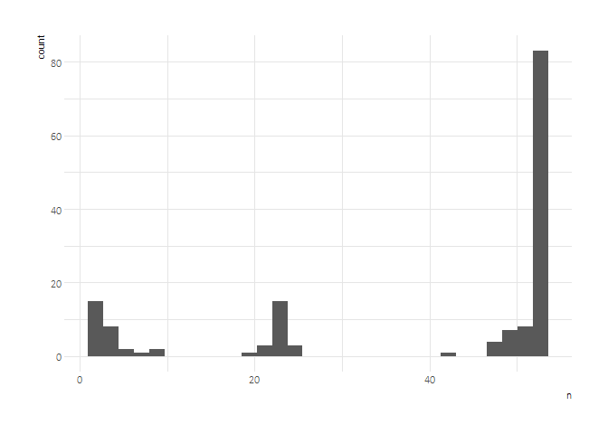
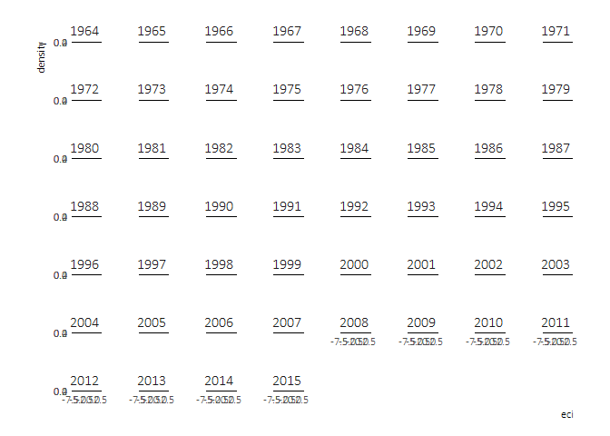
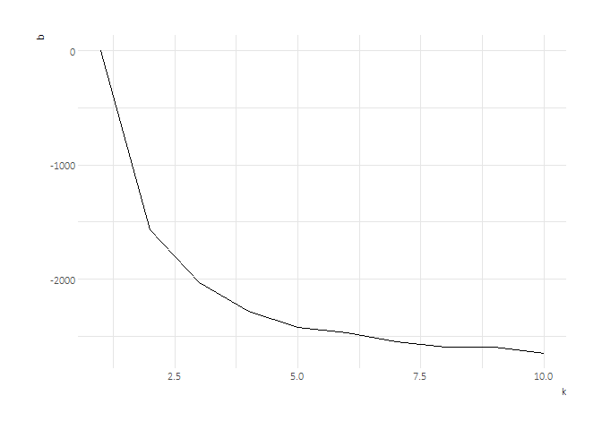
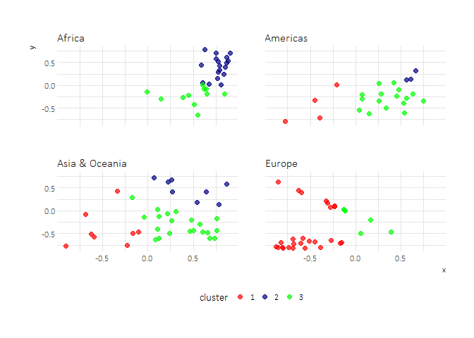
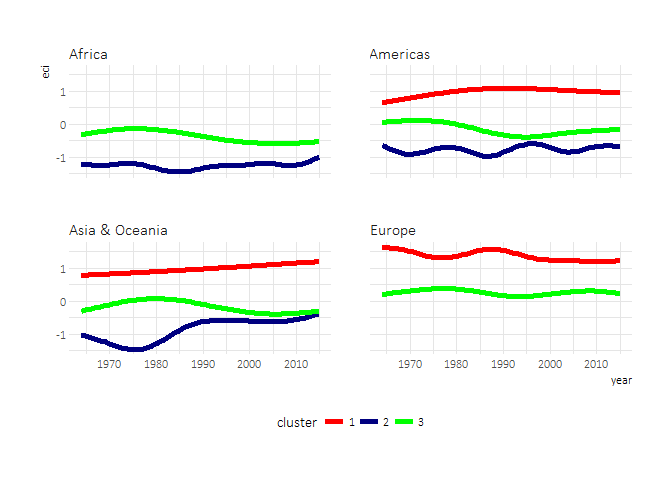

# 
Joshua Kunst  


```r
# packages ----------------------------------------------------------------
rm(list = ls())
library(tidyverse)
library(jbkmisc)
library(tidyr)
library(broom)
library(viridis)
theme_set(theme_jbk())

# data --------------------------------------------------------------------
# dprod <- read_csv("http://atlas.media.mit.edu/en/rankings/hs92/?download=true")
# names(dprod) <- tolower(names(dprod))
# dprod

data <- read_csv("http://atlas.media.mit.edu/en/rankings/country/?download=true")
names(data) <- tolower(names(data))
data
```

```
## # A tibble: 5,881 × 5
##     year  rank    id        country     eci
##    <int> <int> <chr>          <chr>   <dbl>
## 1   1964     1   che    Switzerland 2.30660
## 2   1964     2   swe         Sweden 2.25070
## 3   1964     3   aut        Austria 2.20926
## 4   1964     4   gbr United Kingdom 2.16646
## 5   1964     5   jpn          Japan 2.11512
## 6   1964     6   fra         France 2.01915
## 7   1964     7   usa  United States 2.01312
## 8   1964     8   ita          Italy 1.94026
## 9   1964     9   bel        Belgium 1.88107
## 10  1964    10   nor         Norway 1.73035
## # ... with 5,871 more rows
```

```r
data <- countrycode::countrycode_data %>% 
  tbl_df() %>% 
  select(id = iso3c, continent) %>% 
  mutate(id= tolower(id)) %>% 
  right_join(data, by = "id") 

data %>% 
  count(country, continent) %>% 
  ungroup() %>% 
  count(continent)
```

```
## # A tibble: 5 × 2
##   continent    nn
##       <chr> <int>
## 1    Africa    45
## 2  Americas    24
## 3      Asia    46
## 4    Europe    35
## 5   Oceania     3
```

```r
data <- mutate(data, continent = ifelse(continent %in% c("Asia", "Oceania"),
                                        "Asia & Oceania", continent))

# explore -----------------------------------------------------------------
data %>% 
  count(year) %>% 
  ggplot() +
  geom_line(aes(year, n)) + 
  scale_y_continuous(limits = c(0, NA))
```

<!-- -->

```r
countries_to_study <- data %>% 
  group_by(country) %>% 
  summarise(
    n = n(),
    year_min = min(year)
    ) %>% 
  arrange(n) %>% 
  mutate(pcum = ecdf(n)(n))

ggplot(countries_to_study) + 
  geom_histogram(aes(n))
```

<!-- -->

```r
ggplot(countries_to_study) + 
  geom_line(aes(n, pcum))
```

<!-- -->

```r
countries_to_study <- filter(countries_to_study, pcum > .25)

data <- semi_join(data, countries_to_study)

data %>% 
  count(country) %>% 
  count(n)
```

```
## # A tibble: 10 × 2
##        n    nn
##    <int> <int>
## 1     22    14
## 2     23     1
## 3     25     3
## 4     42     1
## 5     47     1
## 6     48     3
## 7     49     3
## 8     50     4
## 9     51     8
## 10    52    83
```

```r
ggplot(data) + 
  geom_bar(aes(continent, fill = continent)) + 
  scale_fill_viridis(discrete = TRUE)
```

<!-- -->

```r
ggplot(data) + 
  geom_smooth(aes(year, eci, group = continent, color = continent), se = FALSE) +
  scale_color_viridis(discrete = TRUE)
```

<!-- -->

```r
# ggplot(data, aes(year, eci)) + 
#   geom_line(aes(group = country, color = continent), alpha = .4) +
#   geom_smooth(aes(year, eci, group = continent, color = continent), se = FALSE) +
#   facet_wrap(~ continent) +
#   scale_color_viridis(discrete = TRUE) 

# filter(data, eci == min(eci))

data_ae <- data %>% 
  select(id, continent, year, eci) %>% 
  mutate(year = paste0("y", year)) %>% 
  spread(year, eci) %>% 
  arrange(id)


# autoencoder -------------------------------------------------------------
library(h2o)
h2o.init(nthreads = -1)
```

```
##  Connection successful!
## 
## R is connected to the H2O cluster: 
##     H2O cluster uptime:         1 days 4 hours 
##     H2O cluster version:        3.10.3.6 
##     H2O cluster version age:    1 month  
##     H2O cluster name:           H2O_started_from_R_joshua.kunst_jez334 
##     H2O cluster total nodes:    1 
##     H2O cluster total memory:   1.57 GB 
##     H2O cluster total cores:    4 
##     H2O cluster allowed cores:  4 
##     H2O cluster healthy:        TRUE 
##     H2O Connection ip:          localhost 
##     H2O Connection port:        54321 
##     H2O Connection proxy:       NA 
##     R Version:                  R version 3.3.1 (2016-06-21)
```

```r
modae <- h2o.deeplearning(
  x = names(data_ae)[-c(1, 2)],
  training_frame = as.h2o(data_ae),
  hidden = c(400,  100, 2, 100, 400),
  activation = "Tanh",
  autoencoder = TRUE
  )
```

```
## 
  |                                                                       
  |                                                                 |   0%
  |                                                                       
  |=================================================================| 100%
## 
  |                                                                       
  |                                                                 |   0%
  |                                                                       
  |=================================================================| 100%
```

```r
<<<<<<< HEAD
data %>% 
  group_by(year) %>% 
  mutate(ecis = scale(eci)) %>%
  ungroup() %>% 
  group_by(year) %>% 
  do(tidy(summary(.$ecis))) %>%
  ungroup() %>% 
  gather(key, value, -year) %>% 
  ggplot() + 
  geom_smooth(aes(year, value, group = key, color = key), se = FALSE) + 
  scale_color_viridis(discrete = TRUE)
=======
modae
```

```
## Model Details:
## ==============
## 
## H2OAutoEncoderModel: deeplearning
## Model ID:  DeepLearning_model_R_1490031369628_9 
## Status of Neuron Layers: auto-encoder, gaussian distribution, Quadratic loss, 123.054 weights/biases, 1,4 MB, 1.210 training samples, mini-batch size 1
##   layer units  type dropout       l1       l2 mean_rate rate_rms momentum
## 1     1    52 Input  0.00 %                                              
## 2     2   400  Tanh  0.00 % 0.000000 0.000000  0.057940 0.035465 0.000000
## 3     3   100  Tanh  0.00 % 0.000000 0.000000  0.098143 0.128088 0.000000
## 4     4     2  Tanh  0.00 % 0.000000 0.000000  0.005564 0.003290 0.000000
## 5     5   100  Tanh  0.00 % 0.000000 0.000000  0.005870 0.002432 0.000000
## 6     6   400  Tanh  0.00 % 0.000000 0.000000  0.057396 0.035543 0.000000
## 7     7    52  Tanh         0.000000 0.000000  0.024666 0.015309 0.000000
##   mean_weight weight_rms mean_bias bias_rms
## 1                                          
## 2   -0.000002   0.064526 -0.000447 0.012851
## 3    0.000658   0.061811 -0.001738 0.023518
## 4    0.006184   0.109668 -0.003144 0.018315
## 5   -0.015301   0.123890  0.004785 0.025649
## 6   -0.000902   0.062189  0.000384 0.053692
## 7   -0.000567   0.062534 -0.090223 0.058788
## 
## 
## H2OAutoEncoderMetrics: deeplearning
## ** Reported on training data. **
## 
## Training Set Metrics: 
## =====================
## 
## MSE: (Extract with `h2o.mse`) 0.006921064
## RMSE: (Extract with `h2o.rmse`) 0.08319293
```

```r
dautoenc <- h2o.deepfeatures(modae, as.h2o(data_ae), layer = 3) %>% 
  as.data.frame() %>% 
  tbl_df() %>% 
  setNames(c("x", "y")) %>% 
  bind_cols(data_ae)
```

```
## 
  |                                                                       
  |                                                                 |   0%
  |                                                                       
  |=================================================================| 100%
## 
  |                                                                       
  |                                                                 |   0%
  |                                                                       
  |=================================================================| 100%
```

```r
dautoenc
```

```
## # A tibble: 121 × 56
##              x           y    id      continent     y1964      y1965
##          <dbl>       <dbl> <chr>          <chr>     <dbl>      <dbl>
## 1   0.88125764  0.53059263   ago         Africa -1.256440 -1.0850400
## 2   0.39165839 -0.45499888   alb         Europe -0.206252 -0.2027380
## 3   0.10816317  0.03808646   are Asia & Oceania        NA         NA
## 4   0.07381847 -0.29211527   arg       Americas  0.101995 -0.0035103
## 5   0.23861399 -0.49328317   aus Asia & Oceania  0.461866  0.4661700
## 6  -0.81024203 -0.79813829   aut         Europe  2.209260  2.1902100
## 7   0.50425431 -0.42394084   aze Asia & Oceania        NA         NA
## 8  -0.55700378 -0.81728453   bel         Europe  1.881070  1.8920200
## 9   0.75974043 -0.43165748   bgd Asia & Oceania        NA         NA
## 10 -0.15362341 -0.69925966   bgr         Europe  1.132660  0.9963510
## # ... with 111 more rows, and 50 more variables: y1966 <dbl>, y1967 <dbl>,
## #   y1968 <dbl>, y1969 <dbl>, y1970 <dbl>, y1971 <dbl>, y1972 <dbl>,
## #   y1973 <dbl>, y1974 <dbl>, y1975 <dbl>, y1976 <dbl>, y1977 <dbl>,
## #   y1978 <dbl>, y1979 <dbl>, y1980 <dbl>, y1981 <dbl>, y1982 <dbl>,
## #   y1983 <dbl>, y1984 <dbl>, y1985 <dbl>, y1986 <dbl>, y1987 <dbl>,
## #   y1988 <dbl>, y1989 <dbl>, y1990 <dbl>, y1991 <dbl>, y1992 <dbl>,
## #   y1993 <dbl>, y1994 <dbl>, y1995 <dbl>, y1996 <dbl>, y1997 <dbl>,
## #   y1998 <dbl>, y1999 <dbl>, y2000 <dbl>, y2001 <dbl>, y2002 <dbl>,
## #   y2003 <dbl>, y2004 <dbl>, y2005 <dbl>, y2006 <dbl>, y2007 <dbl>,
## #   y2008 <dbl>, y2009 <dbl>, y2010 <dbl>, y2011 <dbl>, y2012 <dbl>,
## #   y2013 <dbl>, y2014 <dbl>, y2015 <dbl>
```

```r
ggplot(dautoenc) + 
  geom_point(aes(x, y, color = continent)) + 
  scale_color_viridis(discrete = TRUE) 
>>>>>>> 4b9eddc114d7972feab7d1b3b83fa5ef9391617f
```

<!-- -->

```r
data <- left_join(data, select(dautoenc, id, x, y), by = "id")

kmeans <- map_df(1:10, function(k){
  data %>% 
    select(x, y) %>% 
    kmeans(k) %>% 
    {.[["betweenss"]]} %>%
    {data_frame(k = k, b = 1 - .)}
}) 

ggplot(kmeans) +
  geom_line(aes(k, b))
```

<!-- -->

```r
kmod <- kmeans(select(data, x, y), 3)

data <- mutate(data, cluster = as.character(kmod$cluster))

ggplot(distinct(data, id, .keep_all = TRUE)) + 
  geom_point(aes(x, y, color = cluster), size = 2, alpha = 0.7) + 
  facet_wrap(~continent) + 
  scale_color_manual(values = c("red", "navy", "green"))
```

<!-- -->

```r
ggplot(data, aes(year, eci, color = cluster)) + 
  geom_smooth(size = 2, alpha = 0.7, se = FALSE) +
  # geom_line(aes(group = country), size = 1, alpha = 0.2) + 
  facet_wrap(~continent) + 
  scale_color_manual(values = c("red", "navy", "green"))
```

<!-- -->


---
title: "readme.R"
<<<<<<< HEAD
author: "Joshua"
date: "Sat Mar 18 01:34:24 2017"
=======
author: "joshua.kunst"
date: "Tue Mar 21 18:44:04 2017"
>>>>>>> 4b9eddc114d7972feab7d1b3b83fa5ef9391617f
---
